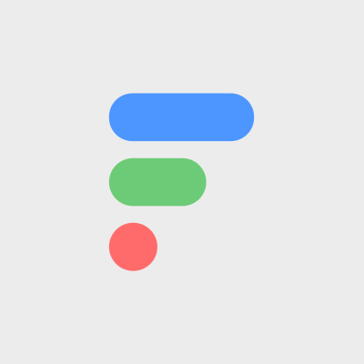

# 🎁 Airdrops & rewards

Rewards are sent out monthly after the end of each contest. The distribution is based on the ranks of each player, with a fair distribution curve and a bit of luck to make things funs. 🍀

Right now the reward pool will primarily consist of materials.

### **Materials**

Each material (except **branded materials)** has a targeted value of the supply of total materials associated with it. You can read this value directly on the card.

  .png>)   .png>)

This value ranges from 48% of the supply for the most common material (Cloth) to 1% of the supply for the most rare material (Dfinity Stone).

Every month the total value of materials that are airdropped will be determined according to the burn rate of our economy. If more people are wearing out accessories, more rewards will be distributed. This will keep our economy balanced from excess inflation/deflation while continuously spreading out the supply to as many participants as possible.

## Airdrop FAQ

### Why do some players get more prizes than other players who ranked higher on the leaderboard?
It's all explained in detail in our [economy design](https://dsquad.gitbook.io/docs/earn/economy-design#leaderboard-and-rewards).

In a nutshell, there is randomization. Think of it as a ongoing raffle ticket system. The odds are weighted by your rank, as in you'd have more raffle tickets the higher you rank, but there's still an element of luck.

With a raffle-type system it's like a lottery pool with super granular prize tiers. Basically, every player gets multiple raffle tickets (winning numbers) assigned for each point they earn. Then a bunch of winning numbers (as many as are needed to distribute the required volume of prizes) are randomly generated. The number of winning tickets a player holds determines their prizes.

It's designed this way to give everyone a chance to win no matter what their rank. For example, if only people of rank 1,000 or above get any rewards, then everyone in ranks 1,000-1,500 is super motivated to try a bit harder, but everyone rank 1,500+ (which would be most players), would have absolutely no reason to care since they are too far behind in rankings to have any hope of catching up. While a handful of players have strong motivation, the rest have none at all.

I admit, with this system the people in the top 10 have little motivation to try to rank higher, but generally every player can know that increasing their rank will increase the odds in their favor. The goal to give as many users as possible a reason to use the Internet Computer as often as they can. Once the game is more heavily weighted by IC activity rather than style points, things should be a bit more balanced out.

For that to happen, we are working on the SDK. The current version is still just an MVP (minimum viable product), we are launching features in stages. 

In summary: you can always increase the odds to your favor, but there's also always an element of luck to it as well. It's not predictable, but it's fair because the same rules apply to everyone.

### Why can’t I validate this Mission?
Due to the privacy-by-default nature of the IC, we can only track activity for the 200+ NFT collections which are integrated with both DAB and CAP. While over 200 collections are integrated with these resources ([you can see a list on DAB](https://dab.ooo/nfts/)) not all of them choose to fully integrate. For example, we found a top IC project which doesn’t log any Buy or Sell transactions in CAP, and only logs other types of transactions like transfers. Without both DAB (the registry of NFT canisters) and CAP (the provenance of NFT transactions), it’s not possible to track a collection’s activity.

Most issues regarding missions are due to either us needing to be clearer on the requirements (we'll try to get better at that), or activity not being trackable for the NFT collection you've been interacting with (yet, we're working on this too!).

### Why isn't my IC activity being tracked?
Right now we are only able to track a limited number of NFT transactions, as explained in the answer above.

The IC was specifically designed to favor privacy-by-default (for both users and dapps) and make it impossible for user activity to be tracked across different applications as is done on web 2.0. Obviously, this inherently makes it difficult for dapps to have the interconnectedness and interoperability that's expected from most web3 networks. Right now the IC doesn't have the tools needed for projects like ours, so we're building an SDK focused on addressing this. More details will be released soon.

Please be patient! The current version is still just an MVP (minimum viable product), we are launching features in stages.

### Why hasn’t my engagement score updated?
The leaderboard is refreshed roughly every 1 hour, so you may need to wait that long after completing a mission until you see your updated score.

## Collaborations

Being part of the biggest community hub on the Internet Computer, we are regularly collaborating with other projects on the IC, most of them like giving away NFTs. **Top ranked players will get more chance to win these limited airdrops.**

Here are some of the projects we collaborated with in the past; more is to come.

 .png>) .jpeg>)  (1).jpeg>)
