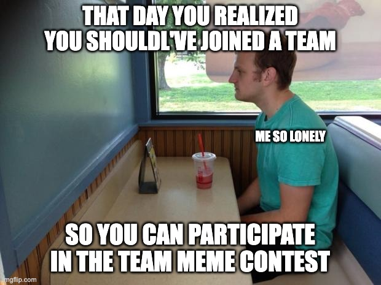
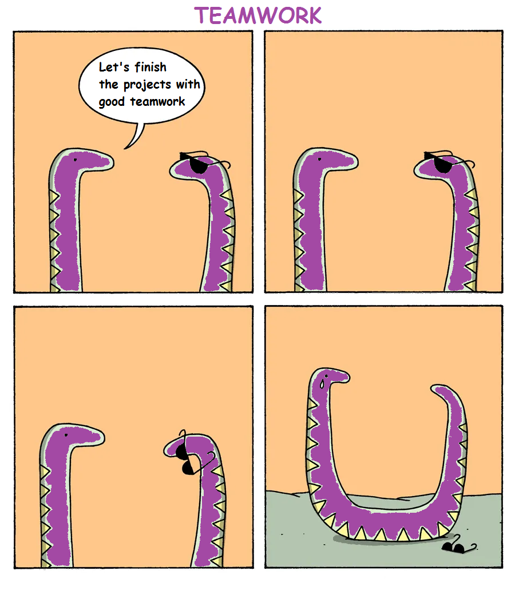

# 🎪 Events & Branded Items

Events are actions that are organized by the community and have a role and impact in the gameplay. They can be fully online event or even physical events. These are rare opportunities to get your hands on special edition accessories & legendary characters.

Branded items are Essences and Accesories themed with the brand of a partner project. These represent an exciting new type of "digital merchandising" for the Internet Computer ecosystem which has never been done before.

### Branded Essences & Accessories

The internal economy is based on 6 materials. These materials are the foundation of our economy and are airdropped regularly trough our leaderboard and monthly reward system.

.png>) .png>)  .png>) .png>) 

However, there will also be **brand essences** & **branded accessories**.&#x20;

An essence is a special type of material which can be used to mint branded accessories. This gives provides a way to integrate other brands within ecosystems. Here's an example with two of the most popular projects on the Internet Computer: **Cronic** & **ICPunk**.

 

These essences will be airdropped during **contests or events hosted by our partner. The goal of those events is to incentivise squad members to discover and play around with dApps of those ecosystems.**&#x20;

These materials can later be used to create **branded accessories**. These accessories have all the properties of normal accessories, but they have new artwork and a different card template that makes them super distinctive.&#x20;

You will also notice that the logo of the accessory is part of the card.&#x20;

The **recipes** for these branded accessories require brand essences, and to collect those players will need to engage with the ecosystem. This is the best way to show your support for a specific community or a cool new dapp.

_In the future, each dapp will be free to create their own branded merchandise and offer special benefits to their fans._

### Community events

This NFT project is part of a larger [community initiative](https://www.dfinitycommunity.com/introducing-dfinity-community/) that aims to make a big impact and help the Internet Computer grow.

This community has ambitions to organise a lot of different initiatives, including hackathons, bootcamps, and conferences.

_This game will be used as a fun way to connect events and create a rich history of all initiatives_**.**

Events will make the game even more dynamic and alive. We want to create unique opportunities to win prizes, learn, and meet other community members.

### History

**Motoko Bootcamp 2022 (March 5th - March 13th)**

Noticing the clear shortage of dev talent and educational ressources in the ecosystem. Isaac (one of our team members) had an idea to address this in the short-term.

After a few months of preparation and a **community grant** from _Dfinity Foundation_ this event was kickstarted on the 5th of March and lasted for 1 week. Everything took place online.

657 students registered and 168 of those students fully enrolled to devote themselves to full time participation during the event. During the event we hosted 36 lectures and mentorship sessions from 20 of the top Dev Mentors in the ecosystem!

.png>)

This event was an incredible opportunity to learn to build dApps on the Internet Computer and make connections with others in the community. This was also a great source of **memes.**

.png>)  

If you want to learn more it here is a few ressources.

* [A student perspective on the Bootcamp.](https://www.dfinitycommunity.com/a-student-review-of-the-motoko-bootcamp/)
* The educational [repository](https://github.com/motoko-bootcamp/education).
* The official YouTube [channel](https://www.youtube.com/channel/UCa7\_xHjvOESf9v281VU4qVw) created for the event.

Now let's flex on a few way cool ways we used the Internet Computer and this game to make it even better. 😎

**Legendary avatars**&#x20;

All the mentors that participated and the winners of the final contest were offered legendary avatars. These are custom made by our artist to look like they do in real life!

A list of all Legendary Avatars can be found on our website.

**Diplomas**

Our friend Isaac was not only the primary organiser for the bootcamp but he was also participating in it as a student. Every student had to conduct a project during the week. He decided to build a minter [application](https://github.com/InternetComputerOG/motoko-bootcamp-diplomas) for creating NFT diplomas for all other students!

Those diplomas were minted after the event to all students that graduated from the event after passing the final test.

Using the application each student is free to set the color on the border of his diploma and use it as a profile picture on DSCVR.&#x20;

* If you see a diploma pulsing the color gold 🟨, that means they are open to receiving job offers for IC development.
* If you see a diploma pulsing the color blue 🟦, that means they are looking to hire an IC dev.

This diploma is bounded to the wallet it was minted into, meaning students cannot sell it. This makes it one of the first _**proof of dev skill.**_&#x20;

_It will be interesting to see if such awards can be used later to help us structure the community and put the skills of everyone at good use. We know for instance that many proposals on the NNS require technical knowledge to be carefully reviewed. Perhaps Motoko Bootcamp graduates to help build a governance council for the squad and collaborate on technical decisions?_&#x20;

**Special accessories**

To make things even more spicy, graduates where offered special accessories that they can equip on their character: the **Mortaboard hat** (all graduates) & **Bootcamp soldier** (3rd runner ups).

.png>) .png>)

Those accessories are both 5 stars accessories, they can be traded or equipped on your avatar.&#x20;

The only difference is that they cannot be minted the traditional way. This will likely make them highly rare as they has been only 50 graduated students. 🤯

**DSCVR Portal**

Using the gated portal functionality from [DSCVR](https://h5aet-waaaa-aaaab-qaamq-cai.raw.ic0.app/) we created the [Motoko Bootcamp portal.](https://h5aet-waaaa-aaaab-qaamq-cai.raw.ic0.app/p/motoko-bootcamp)

The portal can only be accessed if you have your diploma. **The portalo is for all current and future Motoko Bootcamp Graduates!**

Here are some of the things that can be done in this portal.

* **🤝 Make Connections** | Find jobs, employees, volunteers, hackathon teammates, and co-founders.
* **🧪 Share Early Stage Work** | Get feedback, collect alpha testers, offer bug bounties, or just give the IC dev community a head start on your project.
* **🎁 Airdrop Gifts** | We can get a list of principals for you via DSCVR, or you could simply use the getRegistry query on the diploma canister (pgsou-iyaaa-aaaal-aaifq-cai).
* **🤫 Private Tech Discussions** | Let's make this portal a safe place to discuss topics outside of the general public. For example, a founder should be able to ask for help solving an issue with their project without having trolls spreading FUD about the issue. **(🚨 Those who share private information from posts or screenshots of posts may be banned. 🚨)**
* **🧑‍💼 Find or Offer Mentorship** | Let's support one another and build lasting relationships!
* **💭 Brainstorm Deep Topics** | How IC tech might be used to impact DAO governance, IT security, defi, social change, etc.

**Missions**&#x20;

Students didn't really knew it at the time they participated in the camp, but in fact they were participating in one of the first **mission ever**!

_A mission is an action that you have to take, something that you have to collect, or something that you have to learn._&#x20;

By validating their participation in this camp, students will earn points in the leaderboard. This will be a temporary boost in their score. The name of this mission is **Motoko School.**

